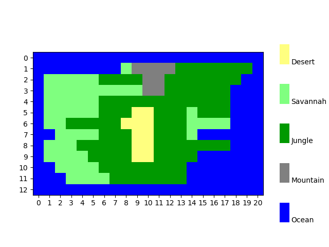

Motivation for the coursework
=============================

As a group of two experts (i.e. students), we were given the task to develop a
population dynamics simulation of Rossumøya, one of the islands belonging to
the imaginary island nation of Pylandia. This was an initiative by The
Environmental Protection Agency of Pylandia (EPAP), as they want to study the
stability of the ecosystem. The long term goal is to preserve Rossumøya as a
nature park for future generations. For more information about the task itself,
see the `complete description. <https://github.com/yngvem/INF200-2019/blob/
master/INF200_H19_BioSim.pdf>`_

   Map of Rossumøya

